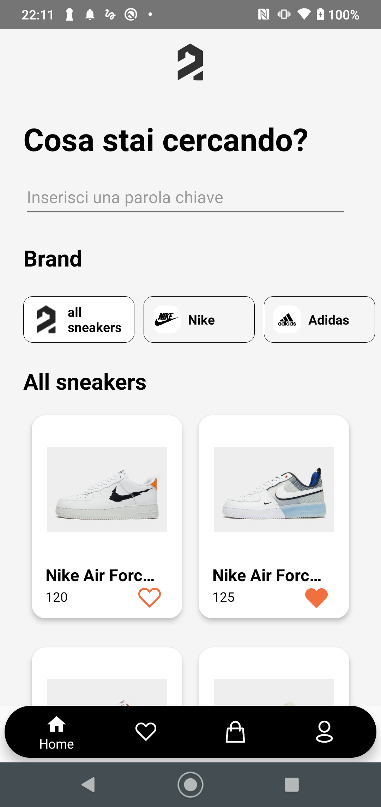
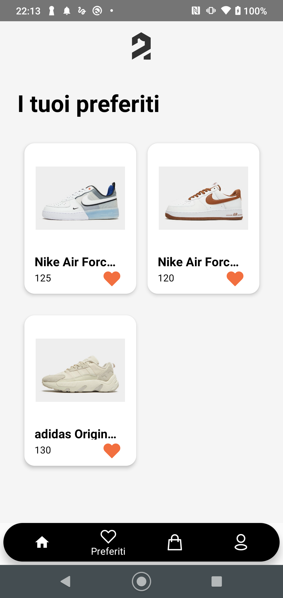
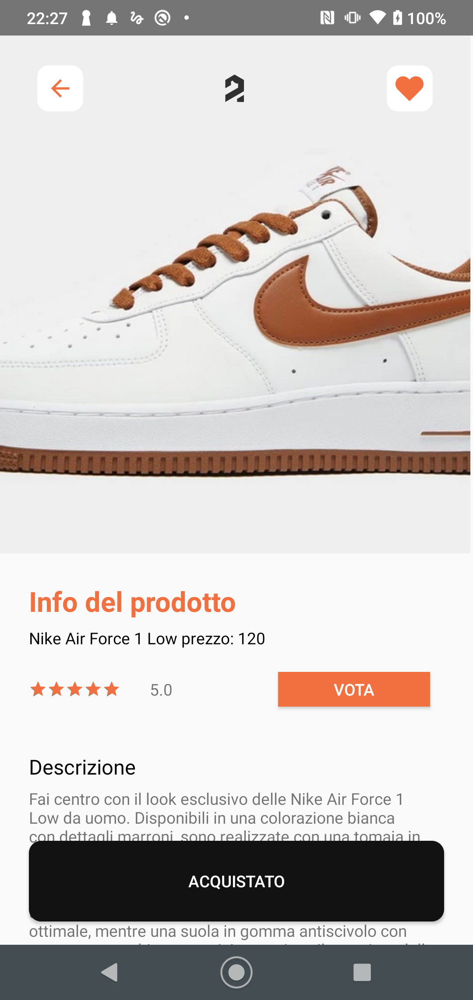
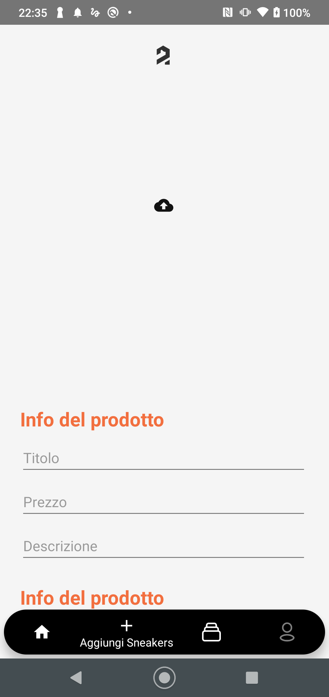

# sneakify

Sneakify is an app developed for the mobile programming course that provides a user-friendly interface to connect buyers and traders for the sale of sneakers. The backend was developed using Firebase ( autentication, realtime database and storage) whereas the frontend was developed in java.

